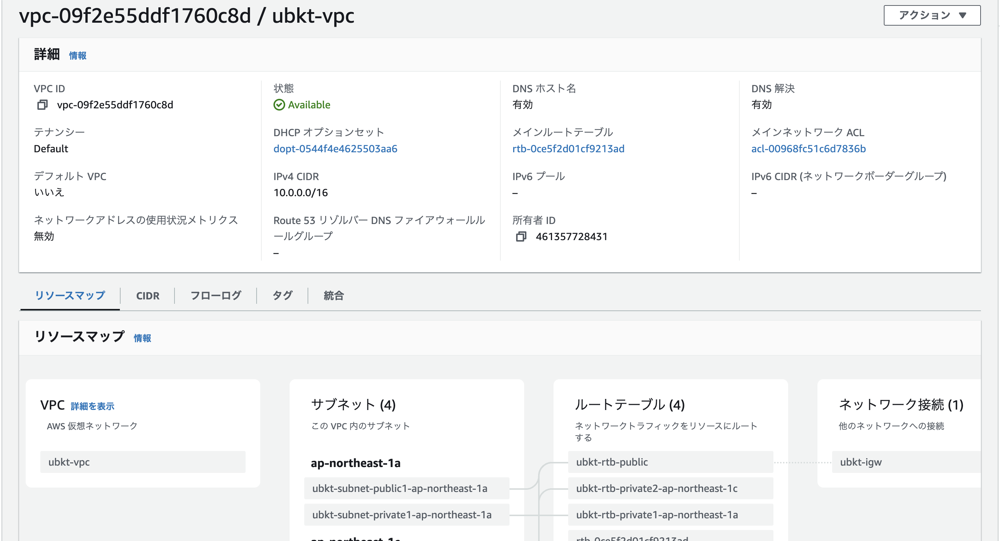
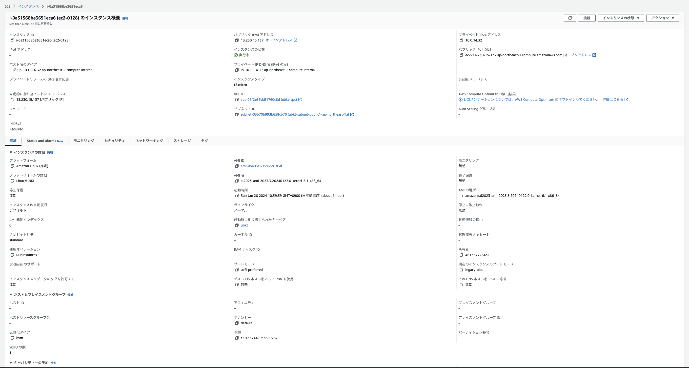
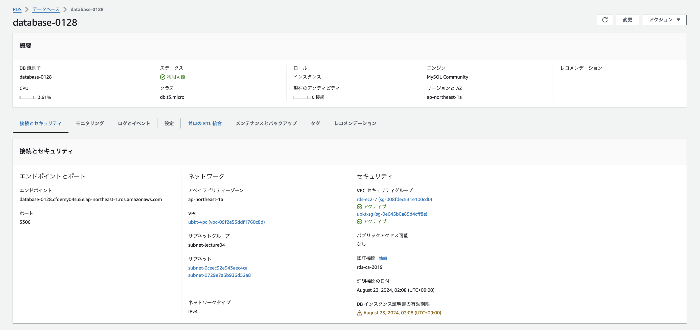
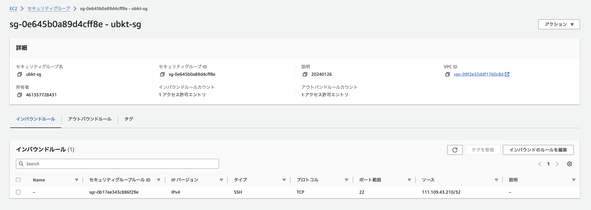
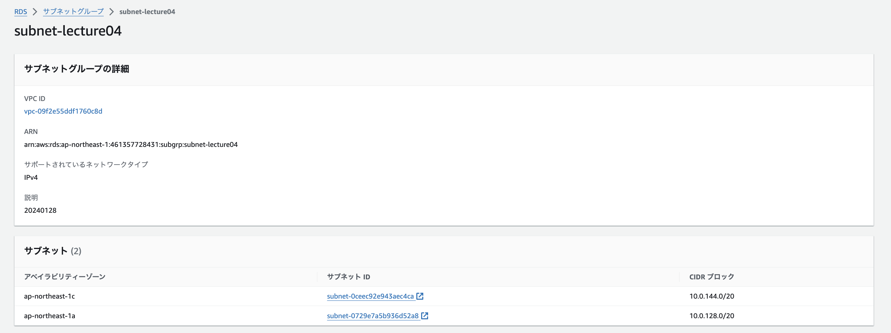
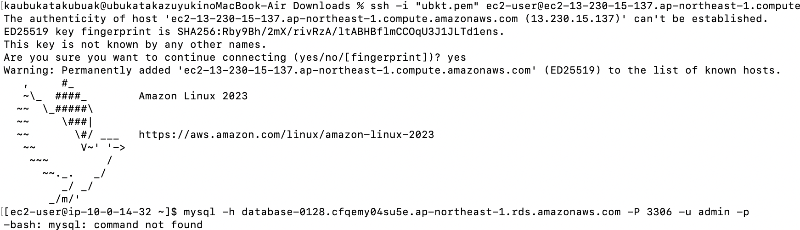
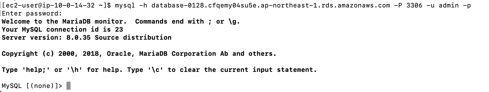

# 第4回課題

* VPC

* EC2

* RDS
  

* セキュリティグループの内容
  

* RDSのサブネットグループに含まれているサブネット
  

* EC2へSSH接続
  

* EC2からRDSへ接続
  

## 感想
 AWSドキュメントやネット記事を見ながら、試行錯誤してどうにかEC２からRDSへ接続できた。
 技術的には初歩的なことだと思うが、達成感を感じることができた。
