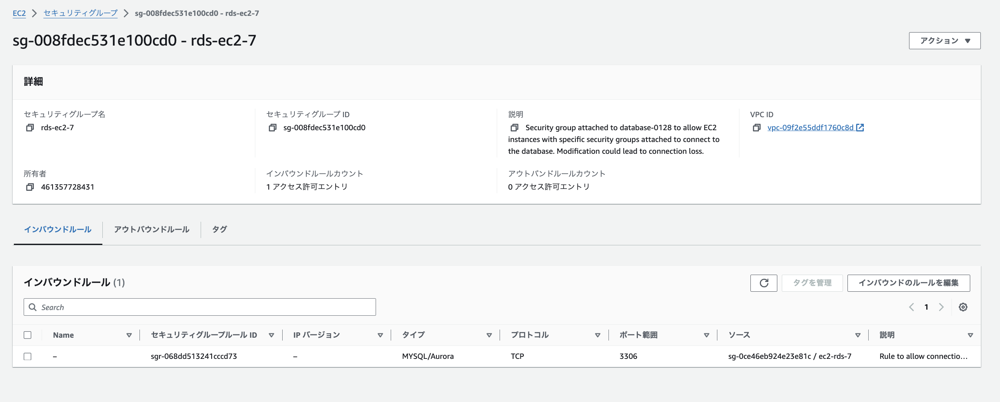
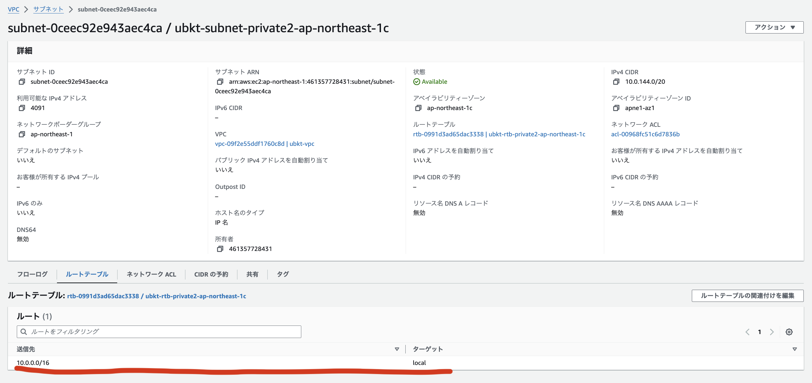

# 第4回課題

* VPC

* EC2

* RDS
  

* セキュリティグループの内容
  

* RDSのセキュリティグループ

* RDSのサブネットグループに含まれているサブネット
  

* RDSのサブネットグループに含まれるサブネットがパブリックかプライベートか判別できるエビデンス

***パブリックサブネットと、プライベートサブネットはルートテーブルによる接続先がインターネットゲーウェイである事、それ以外である事で分類***

* EC2へSSH接続

`ssh -i [キー] ec2-user@[パブリック IPv4 DNS]`
  

* EC2からRDSへ接続

　`sudo dnf update -y`

 `sudo dnf install mariadb`

　`mysql -h [エンドポイント] -P 3306 -u admin -p`
  

